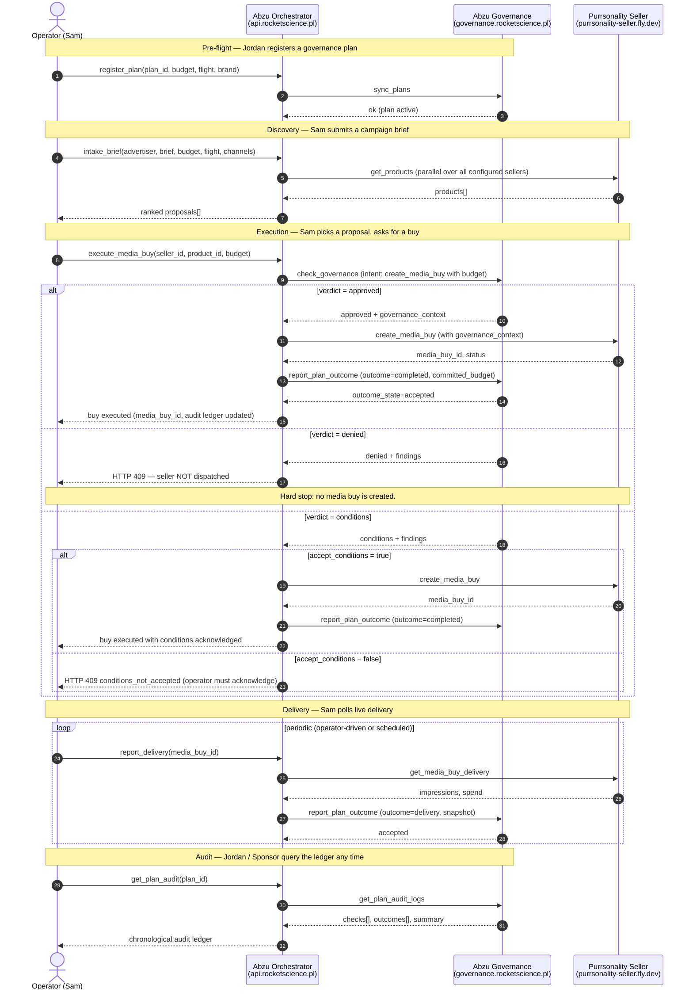

# Abzu — AdCP buyer-side orchestrator

Reference implementation of the **seller — buyer — governance** loop in AdCP 3.1. Three agents executing one campaign:

| Role | Agent | URL | AAO type |
|---|---|---|---|
| **Seller** | Purrsonality | `https://purrsonality-seller.fly.dev/mcp` | `sales` (`sales-non-guaranteed`) |
| **Buyer (orchestrator)** | Abzu Orchestrator | `https://api.rocketscience.pl/mcp` (MCP) · `https://api.rocketscience.pl` (HTTP) | `buying` |
| **Governance** | Abzu Governance | `https://governance.rocketscience.pl/mcp` | `governance` (`governance-spend-authority`) ✅ AAO badge |

Plus a thin operator UI at `https://abzu.rocketscience.pl/?role=sam` (three role views: Sam · Jordan · Sponsor).

## The loop



## What this implementation guarantees

The **buyer-side composition contract** Abzu Orchestrator enforces — the invariants that an `orchestrator-agent` specialism (RFC pending upstream) would grade:

1. **Gate before seller.** `check_governance` always runs before `create_media_buy`. A `denied` verdict in `enforce` mode aborts with HTTP 409 — the seller is never dispatched.
2. **Conditions acknowledgement.** A `conditions` verdict surfaces to the operator with explicit `accept_conditions=true` required for execution. No silent allow.
3. **Outcome completeness.** Every committed buy receives a matching `report_plan_outcome` call. Audit ledger is the source of truth.
4. **Partial-failure resilience.** Multi-seller `get_products` fan-out tolerates per-seller failures. One impaired seller does not block planning.
5. **Persistence across restarts.** Plans, audit events, and known-plan registry survive process restarts (Postgres-backed, Neon eu-central-1 co-located with fly fra).

## Repo layout

```
agents/
  abzu/                  # buyer-side orchestrator (this directory)
    src/
      orchestrator/      # discovery, planning, execution, creative pipelines
      strategy/          # brief intake, scoring, creative payload schema
      governance/        # client for the paired governance agent + Postgres known-plans
      observability/     # structured logging, zod error extraction
    storyboards/         # 6 buyer-side compliance scenarios (5 runnable, 1 doc-only)
    tests/               # 89 unit tests across all modules
    public/              # the operator GUI is in agents/abzu-gui (not here)
    sellers.json         # seller registry — purrsonality + impaired-test fixture
    fly.toml             # production deploy config
    scripts/deploy.sh    # 3-app deploy automation
    docs/                # rfc-orchestrator-agent.md + scenarios index
  governance/            # paired governance agent (independent deployment)
  abzu-gui/              # operator GUI (Sam / Jordan / Sponsor views)
```

## Public stack

| Service | URL | Notes |
|---|---|---|
| Operator GUI | `https://abzu.rocketscience.pl/?role=sam` | Three role views, CORS-enabled fetch to API |
| Buyer HTTP API | `https://api.rocketscience.pl` | `/discovery`, `/planning`, `/execution`, `/governance`, `/creatives` |
| Buyer MCP | `https://api.rocketscience.pl/mcp` | Bearer auth, AAO registration target |
| Governance MCP | `https://governance.rocketscience.pl/mcp` | Bearer auth, AAO `governance-spend-authority` badge ✅ |
| Seller MCP | `https://purrsonality-seller.fly.dev/mcp` | Reference seller, AAO `sales-non-guaranteed` |

## Local development

```bash
# Terminal 1 — governance (:8788)
cd agents/governance
ADCP_AUTH_TOKEN=gov_dev_secret_token_16chars \
DEFAULT_MODE=enforce \
NODE_ENV=development \
bun run dev

# Terminal 2 — orchestrator (:8787)
cd agents/abzu
set -a; . ../seller/.env.local; set +a
export SELLER_PURRSONALITY_SELLER_AUTH_TOKEN="$ADCP_AUTH_TOKEN"
unset ADCP_AUTH_TOKEN
export GOVERNANCE_AGENT_URI="http://localhost:8788/mcp"
export GOVERNANCE_AUTH_TOKEN="gov_dev_secret_token_16chars"
bun run dev

# Terminal 3 — GUI (:4321)
cd agents/abzu-gui
ABZU_BASE_URL="http://localhost:8787" bun run dev

# Browser
open http://localhost:4321/?role=sam
```

## Storyboards (compliance contract)

Each storyboard is behavior-locked — if you change orchestrator semantics, the relevant scenario fails before the change ships.

```bash
# Run one
bun run storyboard governance_approved

# Run all in parallel, matrix output
bun run storyboard all
```

| Storyboard | What it locks |
|---|---|
| `governance_approved` | Happy path — brief → check (approved) → buy → outcome (accepted) → audit |
| `governance_denied_recovery` | Gate fires on over-budget (HTTP 409, no seller hit); operator retries within authority |
| `governance_escalation` | `conditions` verdict requires `accept_conditions=true` ack; both attempts visible in audit |
| `delivery_reporting` | Pull seller snapshot → push to governance as outcome=delivery |
| `seller_impairment` | One impaired seller does not block planning (partial=false at 1/2 ratio) |
| `async_buy_lifecycle` | (doc-only) Async submitted task arm in create_media_buy — unit-tested |

Storyboards use ID convention `orchestrator_agent/<scenario>` per the pending RFC.

## RFC

See `docs/rfc-orchestrator-agent.md` for the proposal to upstream the `orchestrator-agent` specialism in AdCP. Paste-ready into `adcontextprotocol/adcp` issues.

## Status

- ✅ AAO `governance-spend-authority` badge — active
- ✅ 5/5 runnable storyboards PASS on public stack
- ✅ 89/89 unit tests, typecheck clean
- ✅ Postgres-backed persistence (plans + audit + known plans)
- ✅ Three-agent campaign loop runnable end-to-end
- 🚧 MCP wrapper on orchestrator + AAO `type=buying` registration
- ⏸️ Upstream RFC pending
